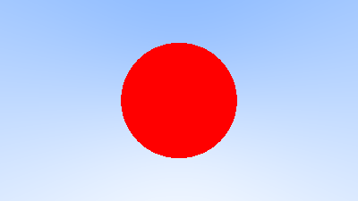
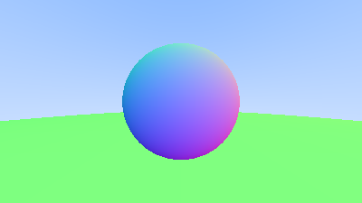
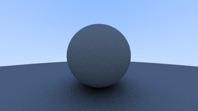
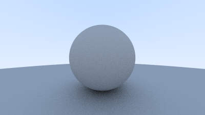
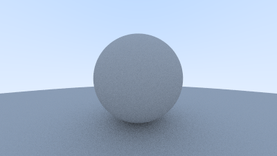
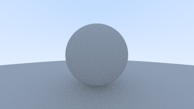
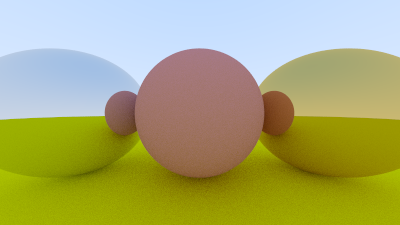
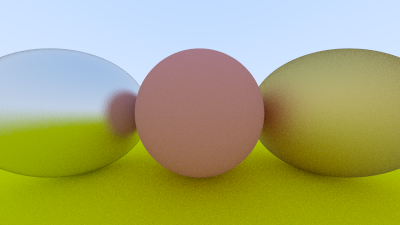
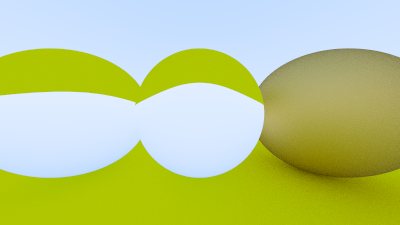

# Raytracing in a weekend (in rust)

An experiment to implement [Raytracing in a weekend](https://raytracing.github.io/books/RayTracingInOneWeekend.html) by [Peter Shirley](https://github.com/petershirley) in [Rust](https://www.rust-lang.org/).

This is mostly a learning experience for me since I am a rust beginner.

## Produced images

### Chapter 2.2

### Chapter 4.2

### Chapter 5.2

### Chapter 6.1

### Chapter 7.2

|                 Before                 |                 After                 |
| :------------------------------------: | :-----------------------------------: |
|  |  |

### Chapter 8.2

### Chapter 8.3

### Chapter 8.5

### Chapter 8.6

### Chapter 9.5

### Chapter 9.6

### Chapter 10.2

